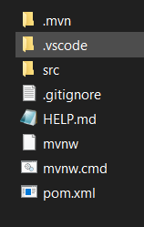

# Creación de proyectos para spring boot

## Alternativas

1. [Spring initializr](https://start.spring.io/)


2. Adicionar dependencia a Visual Code.

- Spring Initializr Java Support  
  

  - Uso :  Ctrl+Shift+P
  - Buscar: 
   
  - Seleccionar:  
  ```
  - version de spring boot (recomandacion 3.2 o superior)

  - java

  - Escribir el nombre del grupo, (ejemplo: co.edu.uptc)

  - nombre del artefacto:  
        Cuando creas un proyecto en Spring Boot y te solicita dar un nombre al "artefacto", se refiere al nombre que se le dará al archivo JAR (Java ARchive) que se generará cuando construyas y empaquetes tu proyecto. Este archivo JAR es el artefacto resultante de tu proyecto Spring Boot y contiene todo el código y las dependencias necesarias para ejecutar la aplicación. (y también corresponde al nombre de la carpeta )

  - Especificar el tipo de paquete, (para nuestro caso jar)
  
  - Especificar la version de java

  - Seleccionar la dependendias.  (recomadaciones para el trabajo de clase)  
    - Spring web service
    - Spring web
            
  ```

  - ## Resultado

  Al terminar de crear el proyecto, se crea una carpeta con los siguientes archivos:
  

  
   
   ### Descripción

   - **.mvn**.  Directorio con librerias de Maven
   - **.vscode**: Directorio con archivo de configuracion del ide (visual code)
   - **src**. Directorio para la ubicación del código fuente
   **.gttignore**.  Archivo en el cual se especifica que archivos del proyecto suben al repositorio de github y cuales no, esto es importente para que unicamente se suba el codigo fuente, de lo coantrario se subira todas las libreria las cuales pueden ocupar demasiado espacio y se demoraria mucho para subir y bajar.

   - **mvnw y mvnw.cmd**: archivos que permiten la ejecución de maven sin necesidad de tenerlo instalado en el sistema operativo

   - **pom.xml**: El archivo pom.xml es un archivo de configuración de Maven en un proyecto Java, incluyendo proyectos Spring Boot. "POM" significa "Project Object Model", y este archivo define la estructura y la configuración del proyecto, incluyendo dependencias, plugins, configuración de compilación, y más.  

   ```
    Aquí hay algunas funciones clave del archivo pom.xml en un proyecto Spring Boot con Maven:

    Definición de dependencias: En la sección <dependencies> del pom.xml, se especifican las dependencias del proyecto. Esto incluye las bibliotecas de terceros que el proyecto utilizará, así como las dependencias internas del proyecto si las hay.
    
    Configuración de plugins de Maven: Maven utiliza plugins para realizar diversas tareas, como compilar el código, empaquetar el proyecto, ejecutar pruebas, etc. En el pom.xml, se pueden configurar estos plugins en la sección <build>.
    
    Configuración del ciclo de vida de construcción: Maven define un ciclo de vida de construcción con fases como clean, compile, test, package, install, etc. El pom.xml define cómo se comporta cada fase del ciclo de vida y qué objetivos de Maven se ejecutarán en cada fase.
    
    Configuración de propiedades: Se pueden definir propiedades en el pom.xml para reutilizar valores en diferentes partes del archivo. Esto puede incluir versiones de dependencias, rutas de directorios, etc.
    
    Configuración de perfiles: Los perfiles de Maven permiten definir diferentes conjuntos de configuraciones y dependencias para diferentes entornos o situaciones. Esto es útil para la gestión de configuraciones específicas de desarrollo, pruebas, producción, etc.
    
    El pom.xml es un componente fundamental en un proyecto Maven y proporciona toda la información necesaria para que Maven construya y gestione el proyecto de manera efectiva. En un proyecto Spring Boot, el pom.xml también incluirá configuraciones específicas de Spring Boot, como la versión de Spring Boot a utilizar y las dependencias relacionadas con Spring Boot.
```

